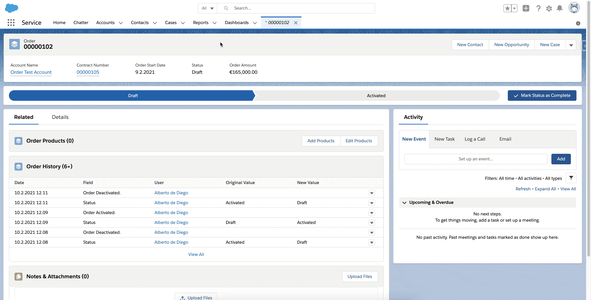

# Salesforce Order Configurator

This project showcases the use of two custom LWC components and a record flexipage in Salesforce.
The page displays all products linked to the standard pricebook and allows to add or remove order items from a standard order.
The order can also be serialized and sent to an external endpoint.



## Component overview

### LWC components

-   **productList**

    -   Displays the standard products: name and standard pricebook price
    -   Sends a message to the orderItems component through the **productOrdering** message channel
    -   Infinite scrolling

-   **orderItems**

    -   Displays the order items: product name, unit price, quantity and total price
    -   Receives the priceBookEntryId and product id through the **productOrdering** message channel from the **productList** component to add a new order item to the order
    -   Delete order items
    -   Send the order to the external endpoint

-   **helper**

    Helper methods

### Flexipage

-   **Order**

    Order Record Flexipage with two sections that contains the productList and orderItems component

### Message channel

-   **productOrdering**

    Message channel with the fields priceBookEntryId and productId

### Apex controllers

-   **ProductListController**

    Controller for the productList component

-   **OrderItemsController**

    Controller for the orderItems component

## Deploying to a Salesforce org

Run the script to deploy the components, after deploying configure the flexipage in Salesforce to override the standard page and access it.

```bash
# deploy the components to the org
sfdx force:source:deploy --manifest ./manifest/package.xml
```

To test the callouts create a [Request Catcher](https://requestcatcher.com/) endpoint and enable the generated endpoint url in Salesforce.

## Local development

To develop locally install the dependencies using npm.

```bash
npm install
```

## Data generation

Use the following code to insert dummy data to test the infinite loading of the datatable.

```java
List<Product2> products = new List<Product2>();
for (Integer i = 1; i < 100; i++) {
    String productNumber = i < 10 ? '0' + i : '' + i;
    products.add(new Product2(Name = 'Test Product ' + productNumber, IsActive = true));
}
insert products;
Pricebook2 pricebook = [SELECT Id FROM Pricebook2 WHERE IsStandard = TRUE LIMIT 1];
List<PricebookEntry> entries = new List<PricebookEntry>();
for (Product2 product : products) {
    entries.add(TestDataUtils.createPricebookEntry(product.Id, pricebook.Id));
}
insert entries;
```
